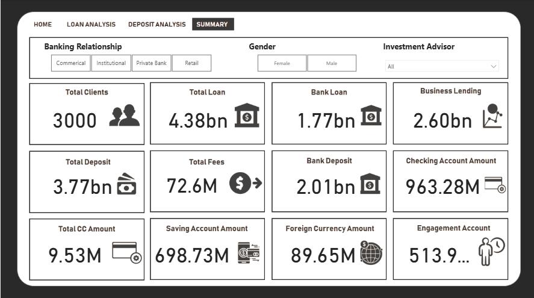

# Banking Risk Analysis Dashboard

## Project Overview
This project analyses banking customer data to identify loan repayment risk and customer behaviour using Power BI.

## Objective
- Analyse customer demographics
- Evaluate loan repayment risk
- Identify high-risk customer segments
- Support data-driven lending decisions

## Tools Used
- Power BI
- Microsoft Excel
- DAX
- Power Query

## Dashboard Features
- Customer demographic analysis
- Loan risk analysis
- Income and account distribution
- Interactive filters and slicers
- KPI cards and charts

## Dataset
The project uses multiple datasets:
- Banking Relationship
- Client Banking
- Gender
- Investment Advisor
- Period

## Dashboard Preview

## Skills Demonstrated
- Data Cleaning
- Data Modelling
- DAX
- Power Query
- Data Visualization
- Business Intelligence